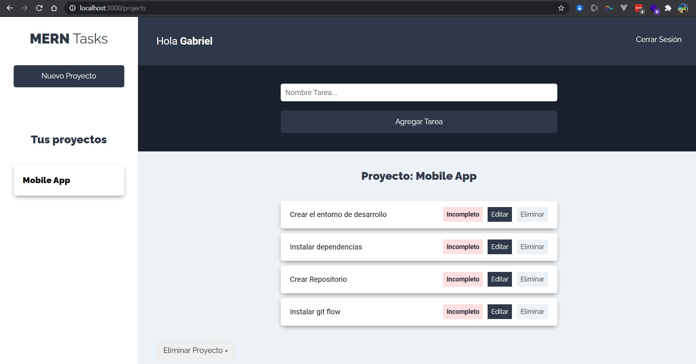

### Proyecto: Gestor de proyectos/tareas

- Este repositorio es sólo el frontend de este proyecto.
- El repo del backend lo encontrarás aquí:  
[https://gabyballester@bitbucket.org/gabyballester/node-mongo-express-projects-tasks](https://gabyballester@bitbucket.org/gabyballester/node-mongo-express-projects-tasks)


***
### Preparación
#### Instalar dependencias
```
yarn install
```

#### Arranque
```
yarn start
```

#### Url y puerto
[http://localhost:3000](http://localhost:3000)


***
### Capturas
###
- Captura del arranque del proyecto
####

###

- Formulario de registro
####


- Área privada
####


- Crear proyecto
####


- Proyecto creado, al seleccionarlo, se muestra a la derecha
####


- Misma vista pero en mobile
####


- Agregar tareas
####


- Pasar tarea a completada
####


- Pasar tarea a completada
####


- Editar tarea
####


- Eliminar tarea
####


- Eliminar proyecto
####


- Cerrar sesión
####


- Al cierre de sesión reenvía a inicio para loguearse
####
